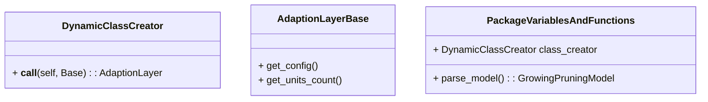
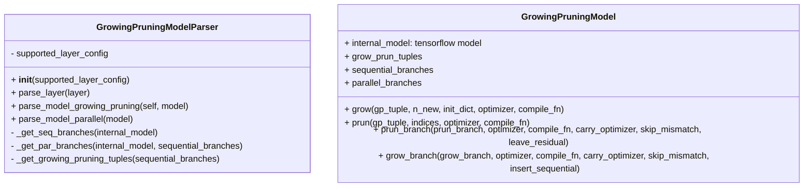
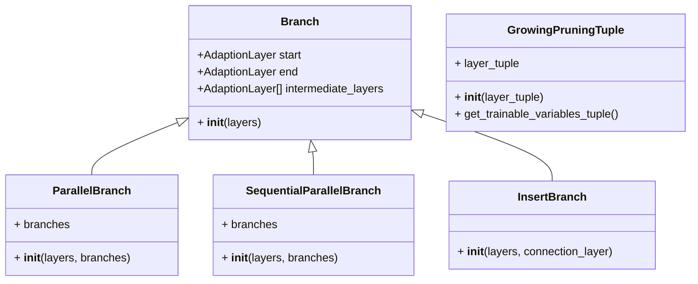
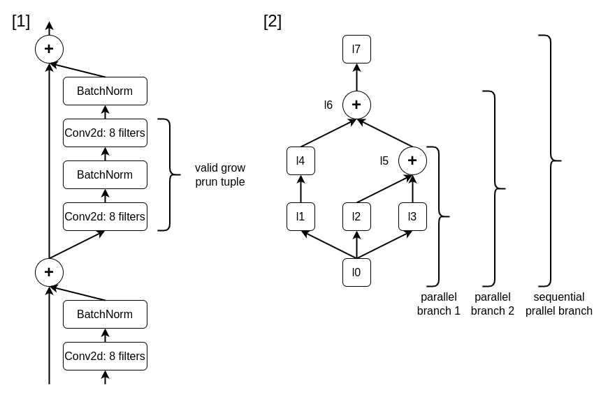
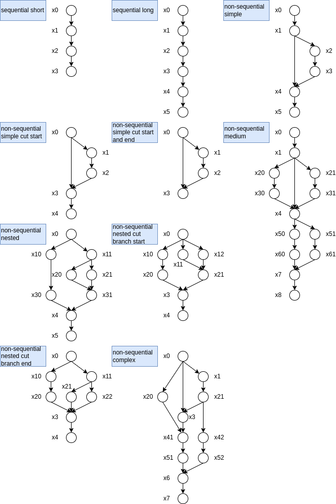
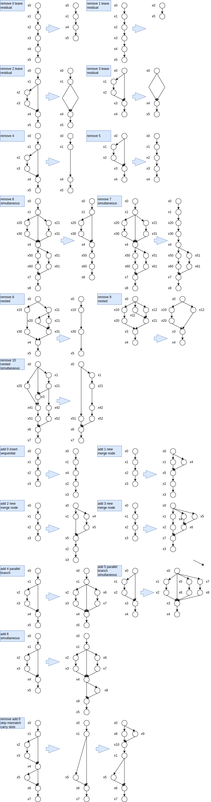

StructureAdaptionFramework: a framework for handling neuron-level and layer-level structure adaptions in
neural networks.

Copyright (C) 2023  Roman Frels, roman.frels@gmail.com

This program is free software: you can redistribute it and/or modify
it under the terms of the GNU Affero General Public License as published by
the Free Software Foundation, version 3 of the License.

This program is distributed in the hope that it will be useful,
but WITHOUT ANY WARRANTY; without even the implied warranty of
MERCHANTABILITY or FITNESS FOR A PARTICULAR PURPOSE.  See the
GNU Affero General Public License for more details.

You should have received a copy of the GNU Affero General Public License
along with this program.  If not, see <https://www.gnu.org/licenses/>.

# Structure Adaption Design Documentation

The structure adaption framework is a comprehensive tool to enable 
tensorflow (and possibly later other deep learning frameworks) to support
structured architecture adaption (also called growing and pruning) during training. 
Supported are neuron-level, layer-level and cell-level adaptions, 
meaning that individual neurons, layers and cells (combination of layers) can be added or removed. 
Unstructured adaption is out of scope, but could be trivially achieved by setting
individual weights to zero. 

The framework parses the model for valid adaptions (e.g. you can't just 
remove one constituent from a concatenate function) and delivers conveniently
a set of all adaptable structures of the network, so no further parsing of the architecture
is necessary. More on valid structures and adaptions can be found below.
The framework provides easy to use methods for all supported types of structure adaption and even
updates optimizer slots that might be related to weights. 
It enables users to focus only on the adaption criteria (growing and pruning criteria). 

### Capabilities
- Adapt the model architecture during training
- Retrieve all adaptable network structures in a convenient form
- Remove neurons from layers and add neurons to layers (while specifying the newly added weights)
- Remove or add (multiple) layers in complicated arrangements either in sequence or parallel. 
- Don't worry about optimizer slots, since they are managed for you

### Current Limitations
- Currently, the framework requires that there is a single input layer and a single output layer in the input model. 
- Grow and prun branches have one start and one end node.
- By default, it introduces ```Add``` layers when a new merge node has to be introduced for a new parallel branch.
- There can't be any identical connections removed in a prun branch (meaning two connection with same start and end layer)
- Currently only one penultimate node in an ```InsertBranch``` that is grown is permitted (will be fixed soon).

Furthermore, it is good to keep in mind that adaptions require that the model be deep copied and newly 
initialized. Therefore, adaptions should be performed rarely in comparison to training steps. 

## Table of Contents
1. User facing classes, methods, attributes, functions and variables
2. Structure adaption theory
3. Implementation details and caveats
4. Tests

### 1. User facing classes, methods, attributes, functions and variables

When using the structure adaption framework the input model is first 
parsed with ``` parse_model() ``` returning a ``` GrowingPruningModel ```.
Internally all layers are deep copied as Adaption Layers. Adaption Layers are 
created by an instance of the ```DynamicClassCreator```. 
This will create a new AdaptionLayer class for each basic tensorflow layer class when the layers are parsed.
The ```AdaptionLayerBase``` acts as a mixin and expands the functionality of Adaption Layers.

The ``` GrowingPruningModel ``` is the gateway to get all adaptable 
structures in a convenient and valid form and grow or prun the internal tensorflow model. 
After each adaption the adaptable structures need to be retrieved again, since the old ones 
refer to the previous internal model.


Note: Only important aspects of classes are presented here:


#### Adaption structures

A ``` GrowingPruningTuple ``` holds several ``` AdaptionLayer ```s. The first layer is the one where 
neurons are added or removed, in the last layer the inputs are changed accordingly. 
Intermediate layers that preserve the dimension (e.g. BatchNormalization) don't have a notion of 
neurons, but their variables need to be changed as well in accordance with the change in the first layer.
Individual layers can therefore appear in several ``` GrowingPruningTuple ```s, as first or last layer.
The ``` GrowingPruningTuple ``` class is exclusively used to perform neuron-level adaptions.

When doing layer-level -, or cell-level adaptions, ```Branch```es need to be considered. 
The base class ```Branch``` holds an individual start layer, -end layer and possibly several intermediate layers. 
It is usually used to represent a purely sequential branch of layers, but not exclusively.
The provided ```layers``` argument in ```__init__(layers)``` is a list that must hold the start layer as first 
item of the list and the end layer as last item of the list. 
The remaining layers must be in sequence order, when applicable. 

The ```ParallelBranch``` class contains several branches that have the same start- and end layer. 
The different branches can be accessed over the ```branches``` attribute. 
The ```SequentialParallelBranch``` is a sequence of sequential branches and parallel branches 
that has again a single start and end layer. 
The different branches can be accessed over the ```branches``` attribute.

Finally, the ```InsertBranch``` is used to define branches that are newly grown. The existing layer of the model 
, where the new branch is originating, is the first layer of the ```layers``` argument. 
The new layers of the grow branch are connected to this layer and also added to ```layers```. The connection layer, 
where the new branch is merged again into the existing network can not be connected, since its inputs are already defined. 
To highlight this, it is added as a separate argument. If the connection layer isn't already a merge node, 
a new ```Add``` node will be added by the framework before the connection layer, using the old and the newly added inputs.  

### 2. Structure adaption theory
As was already alluded to, the framework provides valid structures for growing and pruning. 
Valid in this context means that the network is able to handle them. 
More complicated structures would be possible in theory, but require a more capable support. 

As described, a ``` GrowingPruningTuple ``` holds several ``` AdaptionLayer ```s. 
It starts and terminates with a layer that has a notion of neurons and may have output dimension conserving
intermediate layers in between. In section [1] of the following graph a generic residual cell with the only valid 
grow prun tuple can be seen. Grow prun tuples are only formed in sequential branches and can't cross merge layers.

In section [2] two different parallel branches and a sequential-parallel branch can be seen. A parallel branch 
contains different sub-branches that can be sequential-, sequential-parallel, or parallel branches themselves. 



### 3. Implementation details and caveats

Tensorflow layers rely on tensors as weights. It is unclear which dimensions correspond to neurons, 
filters, inputs, etc. There doesn't seem to be a written convention for this. 
Most often the last dimension (-1) represents filters or neurons and the penultimate dimension (-2) represents inputs.
To rely on this  implicit convention for growing and pruning is risky. 
Therefore, a defining config is necessary, that stores this information for supported layers. 
The config, of which an example can be seen below, specifies if the layer class has a notion of neurons 
(indicated by ```grow_prun_able```). Furthermore, depending on if the neurons are changed, the layer is an 
intermediate layer, or if the inputs are changed, there needs to be specified which dimension to change for each 
weight by name.

The specifications for each supported layer are formatted like this example: 

```python
import ml_collections

def get_config():
  """Builds and returns config.
  Represents supported layers.
  """
  config = ml_collections.ConfigDict()

  config.Conv2D = ml_collections.ConfigDict()
  config.Conv2D.type = tf.keras.layers.Conv2D
  config.Conv2D.grow_prun_able = True
  config.Conv2D.weight_count = 2
  config.Conv2D.change_neurons = {'weight0': -1, 'weight1': -1}
  config.Conv2D.change_intermediate = None
  config.Conv2D.change_inputs = {'weight0': -2}

  return config
```

### 4. Tests

Here is some additional information to understand the tests.
In the tests (```structure_adaption_test.py``` / ```InternalModelTest```) lots of different test networks were trialed.
These can be seen in the following illustration.



Furthermore, it is hard to grasp the adaptions performed in the tests. 
This can be seen in the following illustration.

